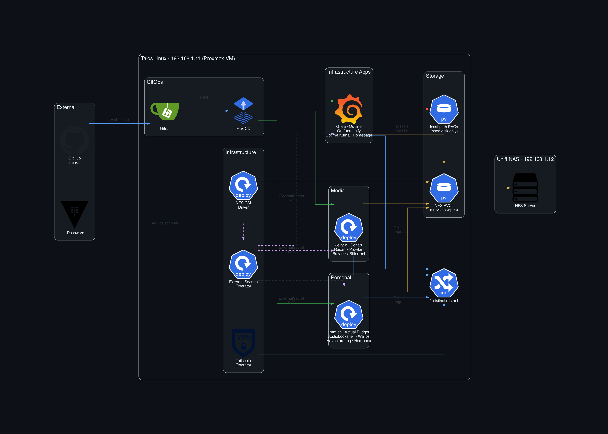
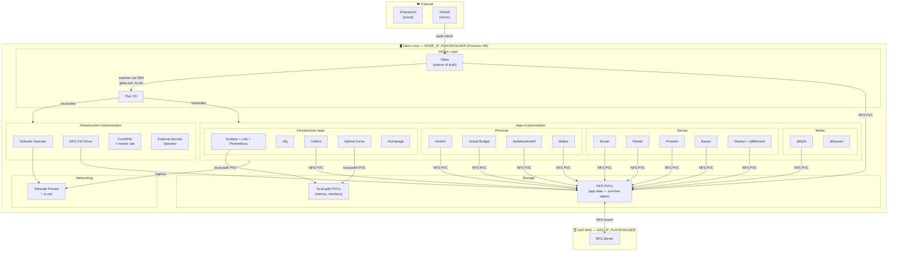
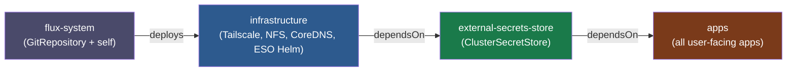
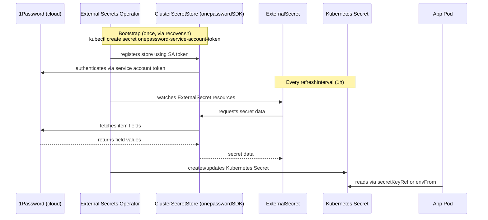

# talos-home

GitOps config for a single-node [Talos Linux](https://talos.dev) cluster running on Proxmox. Managed with [FluxCD](https://fluxcd.io).

## Stack

| Layer | Tools |
|---|---|
| OS | Talos Linux |
| Hypervisor | Proxmox |
| GitOps | FluxCD + Gitea |
| Ingress | Tailscale Operator |
| Storage | local-path (node) · NFS (Unifi NAS) |

## Apps

| App | Purpose |
|---|---|
| [Jellyfin](https://jellyfin.org) | Media server |
| [Jellyseerr](https://github.com/Fallenbagel/jellyseerr) | Media requests |
| [Sonarr](https://sonarr.tv) | TV show management |
| [Radarr](https://radarr.video) | Movie management |
| [Prowlarr](https://github.com/Prowlarr/Prowlarr) | Indexer manager |
| [Bazarr](https://www.bazarr.media) | Subtitles |
| [qBittorrent](https://qbittorrent.org) | Torrent client (via Gluetun VPN) |
| [Immich](https://immich.app) | Photo library |
| [Audiobookshelf](https://audiobookshelf.org) | Audiobooks & podcasts |
| [Actual Budget](https://actualbudget.org) | Personal finance |
| [Wallos](https://wallosapp.com) | Subscription tracker |
| [AdventureLog](https://adventurelog.app) | Travel tracker |
| [Homebox](https://homebox.software) | Home inventory |
| [IT Tools](https://it-tools.tech) | Developer utilities |
| [BentoPDF](https://bentopdf.com) | PDF toolkit |
| [Homepage](https://gethomepage.dev) | Dashboard |
| [Gitea](https://gitea.io) | Git repositories |
| [WatchYourLAN](https://github.com/aceberg/WatchYourLAN) | Network monitor |
| [LibreSpeed](https://librespeed.org) | Speed test |
| [Outline](https://www.getoutline.com) | Wiki & docs |
| [Uptime Kuma](https://uptime.kuma.pet) | Uptime monitoring |
| [Ntfy](https://ntfy.sh) | Push notifications |
| Grafana + Loki + Prometheus | Metrics & logs |

## Architecture

### Cluster overview



> **Edge colours:** 🔵 blue = GitOps / networking · 🟢 green = Flux reconcile · 🟣 purple = secrets · 🟡 yellow = NFS storage · 🔴 red = local-path storage

<details>
<summary>Mermaid source (text version)</summary>



</details>

### Flux reconciliation order



### Secret management



## Repo structure

```
kubernetes/
  apps/          # user-facing applications
  infrastructure/  # cluster-level components (Tailscale operator, storage classes)
  flux/          # FluxCD bootstrap
talos/           # Talos machine config patches
scripts/         # tooling
```

## Recovery

### Prerequisites
- NAS must be online (all NFS-backed app data lives there)
- Tailscale and 1Password signed in on your Mac
- The repo cloned locally, or accessible via GitHub mirror

> **Gitea dependency**: The recovery script is hosted on Gitea, which runs on the cluster. If the cluster is completely gone, use the GitHub mirror instead (same content, push-mirrored on every commit).

### Step 1 — Reinstall Talos on the new VM

In Proxmox, boot the new VM from the Talos ISO, then apply the machine config:

```bash
talosctl apply-config --insecure --nodes NODE_IP_PLACEHOLDER --file talos/controlplane.yaml
```

> The machine config is in this repo under `talos/`. Fetch it from 1Password or the GitHub mirror if Gitea is unavailable.

### Step 2 — Restore tooling and repo

On your Mac — the script auto-detects whether Gitea is up and falls back to the GitHub mirror if not:

```bash
curl -s https://gitea.<tailnet>.ts.net/admin/talos-home/raw/branch/master/scripts/recover.sh | bash
```

If Gitea itself is unreachable (total cluster loss), fetch from GitHub instead:

```bash
curl -s https://raw.githubusercontent.com/d-goncalves/talos-home/master/scripts/recover.sh | bash
```

This fetches the talosconfig from 1Password, generates kubeconfig, bootstraps the External Secrets Operator token, and clones the repo to `~/talos`.

### Step 3 — Bootstrap Flux

`recover.sh` creates two manual secrets that are never stored in git:

| Secret | Namespace | Purpose |
|---|---|---|
| `onepassword-service-account-token` | `external-secrets` | ESO → 1Password auth |
| `cluster-vars` | `flux-system` | Flux variable substitution (`TAILNET_DOMAIN`) |

```bash
kubectl apply -k ~/talos/kubernetes/flux
```

Flux's `GitRepository` source points to `ssh://git@gitea-ssh.<tailnet>.ts.net` (the Tailscale address). CoreDNS has a rewrite rule that resolves this to the `gitea-ssh-tailscale` LoadBalancer service inside the cluster. On a fresh cluster the Tailscale Operator and Gitea must be running before Flux can sync — Flux will retry automatically once they come up.

> **Bootstrap order**: Flux applies the infrastructure Kustomization first (Tailscale Operator, NFS CSI, CoreDNS patch), then apps. The Tailscale Operator will register the `gitea-ssh` proxy in the tailnet and Gitea will deploy. Flux retries every minute, so recovery is fully automatic — just wait a few minutes after bootstrap.

Once Flux can sync, it reconciles all apps automatically. Most app data is on NFS and survives node wipes.

### What survives a full node wipe

| Storage | Apps | Survives wipe? |
|---|---|---|
| NFS (Unifi NAS) | Jellyfin, Immich, Sonarr, Radarr, Prowlarr, Bazarr, qBittorrent, Audiobookshelf, Actual Budget, Wallos, Homebox, AdventureLog, Gitea, Outline | ✅ Yes |
| local-path (node disk) | Uptime Kuma (monitors), Prometheus metrics, Grafana dashboards | ❌ No |

### Post-recovery manual steps

After Flux reconciles, the following need manual reconfiguration if the node was wiped:

- **Outline** — data is on NFS, restores automatically ✅
- **Uptime Kuma** — monitors need to be re-added in the UI
- **Ntfy** — admin user is recreated automatically by init container ✅
- **Servarr apps** — Sonarr/Radarr/Prowlarr/Bazarr config is on NFS, should restore automatically ✅

### Secrets management

All app secrets are managed by [External Secrets Operator](https://external-secrets.io) and pulled from 1Password automatically. The only manual bootstrap step is the ESO service account token (handled by `recover.sh`).

The token is stored in 1Password under **"1Password Service Account - talos-home"** in the Server Infrastructure vault. If you need to rotate it, generate a new token at [1password.com](https://1password.com) → Integrations → Service Accounts, then re-run:

```bash
kubectl create secret generic onepassword-service-account-token \
  --from-literal=token=<new-token> \
  --namespace external-secrets \
  --dry-run=client -o yaml | kubectl apply -f -
```

